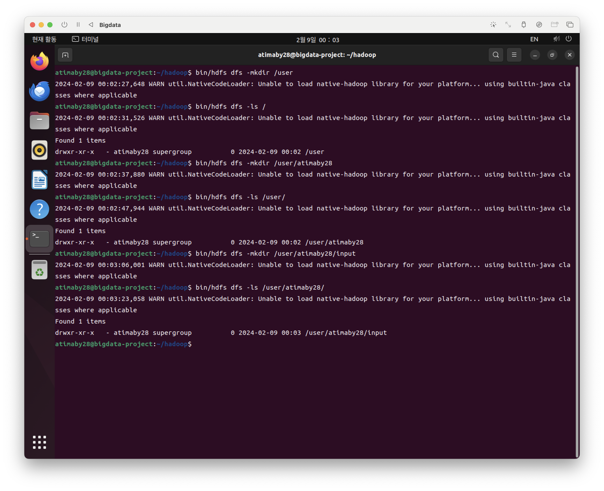
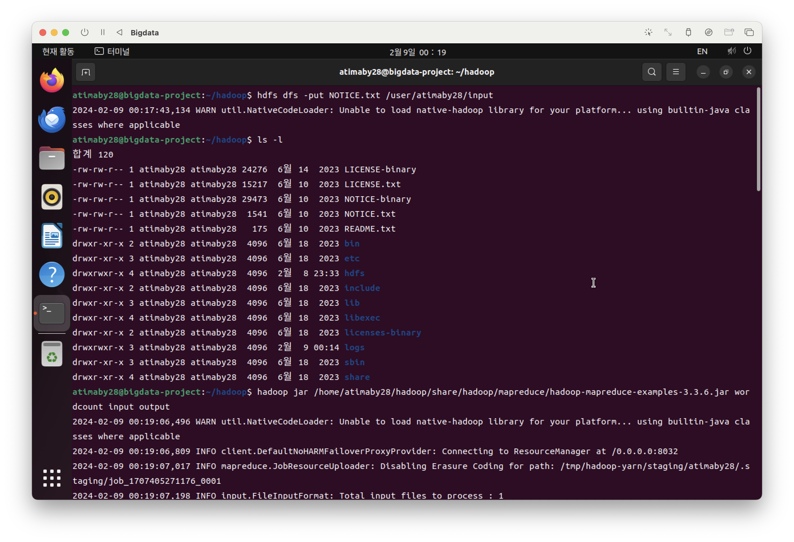
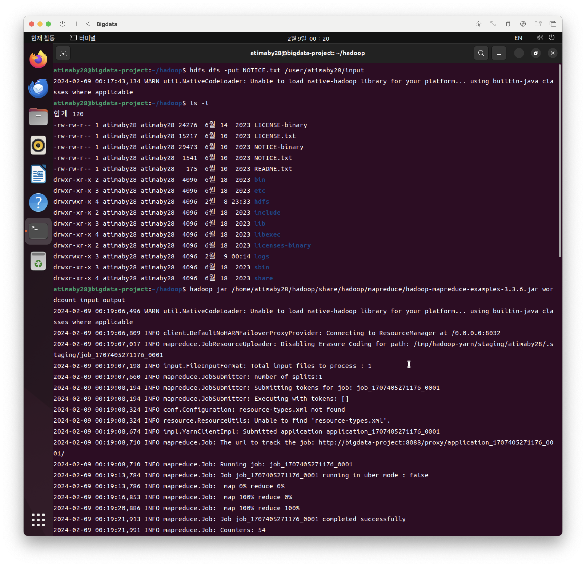
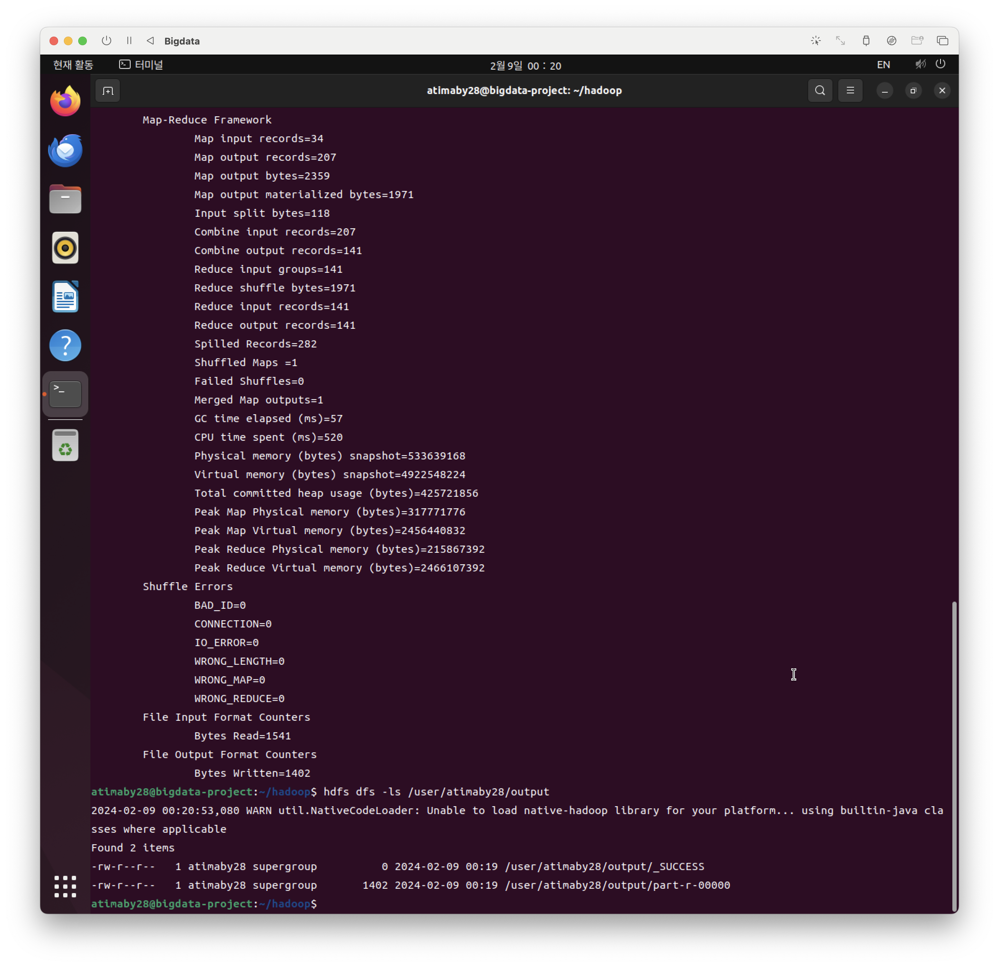
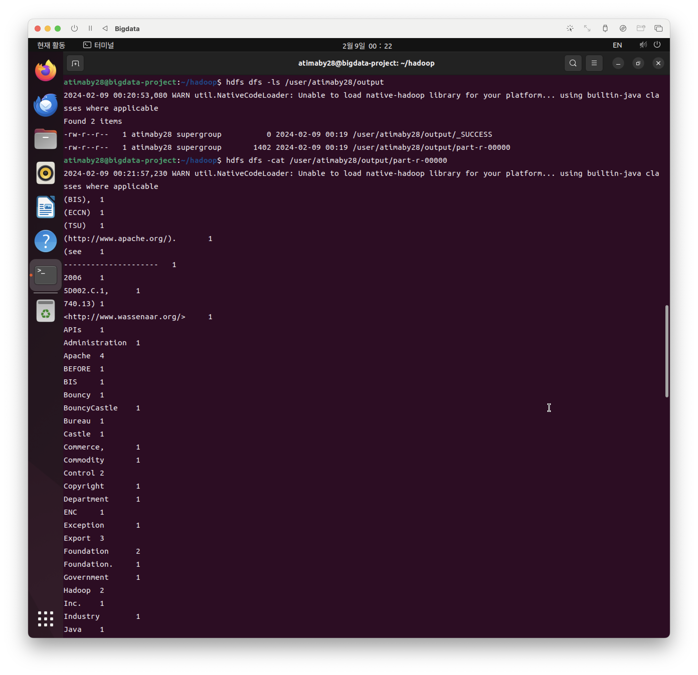
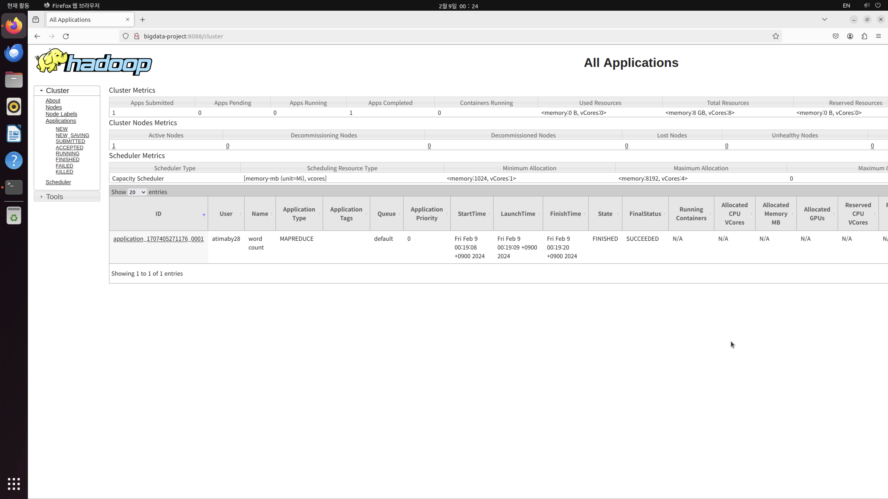
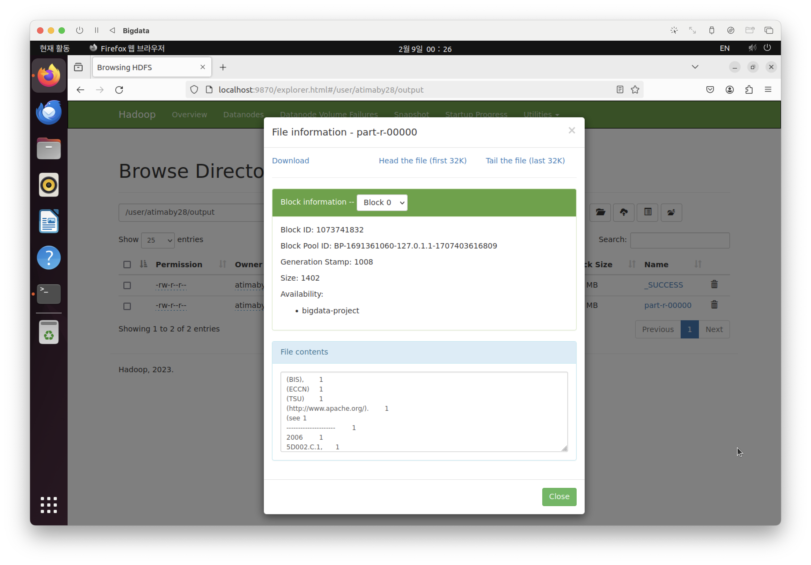

MapReduce 기본 예제를 실행 해 보았습니다.

# 기본 설정


먼저 아래의 명령어로 파일을 생성 후에 진행합니다.

```
bin/hdfs dfs -mkdir /user
bin/hdfs dfs -mkdir /user/atimaby28
bin/hdfs dfs -mkdir /user/atimaby28/input
```


다음 명령어를 통해 실행해 줍니다.
```
hdfs dfs -put NOTICE.txt /user/atimaby28/input
```



다음 명령어를 통해 실행해 줍니다.
```
hadoop jar /home/atimaby28/hadoop/share/hadoop/mapreduce/hadoop-mapreduce-examples-3.6.6.jar wordcount input output
```


MapReduce 작업이 끝난 화면입니다.





UI 환경으로 하둡을 확인해 보았습니다.





결과는 ./result에 저정했습니다.