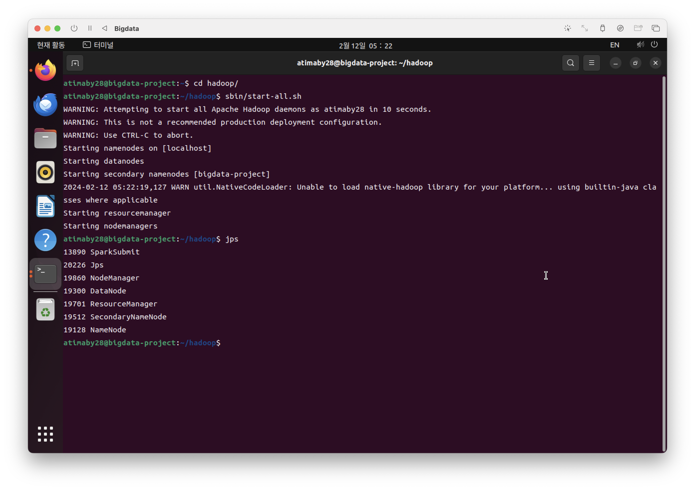
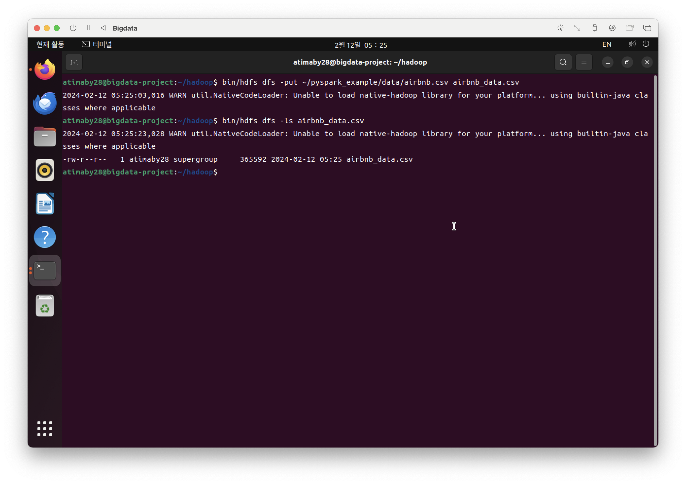
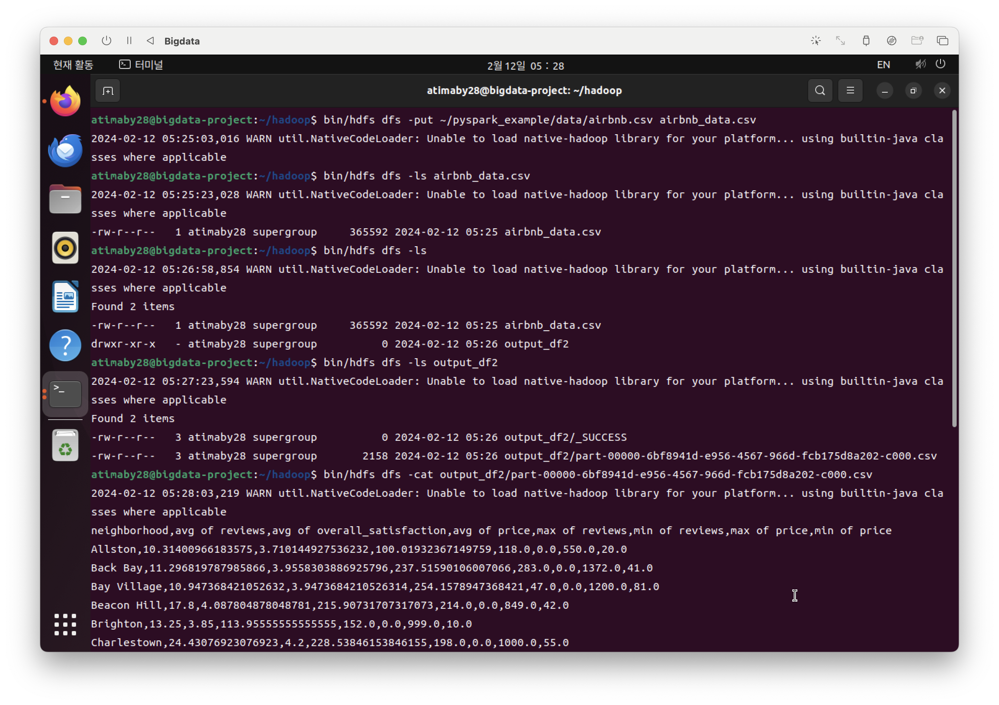
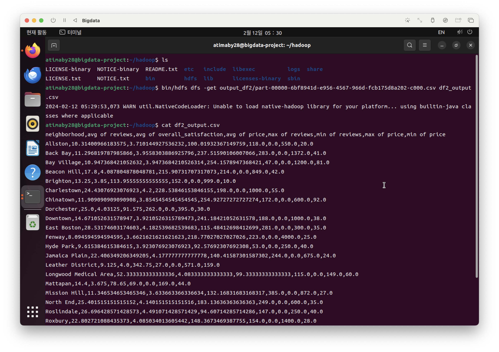

airbnb 예제를 HDFS와 Pyspark를 통해 해겷해보는 예제입니다.

# 기본 설정


다음 명령어를 통해 데몬을 모두 실행시켜 줍니다.

```
sbin/start-all.sh
```



다음 명령어를 통해 HDFS에 올려줍니다.
```
bin/hdfs dfs -put ~/pyspark_example/data/airbnb.csv airbnb_data.csv
```


jupyter notebook에서 실행한 output_df2 파일이 올라간 것을 확인했고,



이것을 다시 로컬 환경으로 가져왔습니다.



