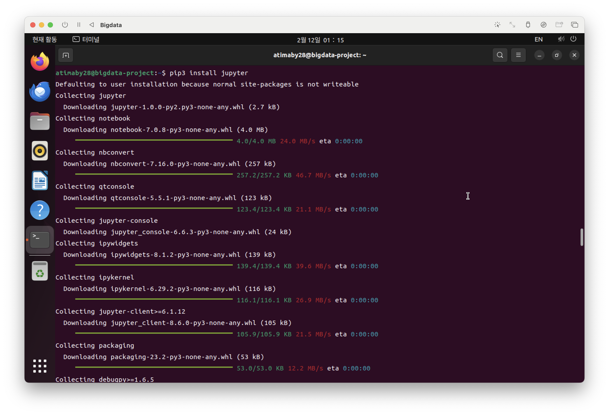
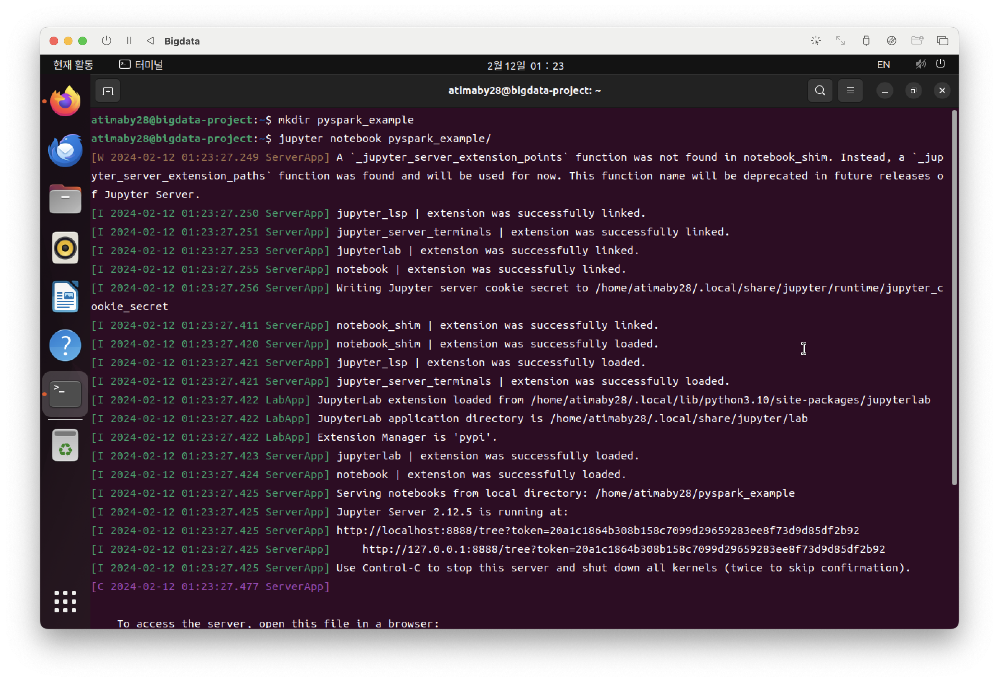

# 기본 설정


먼저 아래의 명령어로 업데이트를 해줍니다.

```
sudo apt-get update
```


다음 명령어들로 필요한 라이브러리를 설치합니다.

```
sudo apt install python3-pip
```

```
pip3 install jupyter
```

```
pip3 install findspark
```
```
pip3 install ipykernel
```

```
pip3 install pyspark
```
```
pip3 install pandas
```


다음 명령어로 스파크 설치와 압축 해제를 진행합니다.
```
wget https://downloads.apache.org/spark/spark-3.5.0/spark-3.5.0-bin-hadoop3.tgz
```


```
tar zxf spark-3.5.0-bin-hadoop3.tgz
```


마지막으로 주피터 노트북을 설치하여 실행합니다.

```
sudo apt install jupyter-notebook
```


저는 따로 파일을 만들어 그 곳을 루트로 시작하였습니다.




